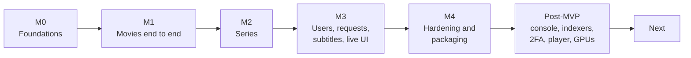

# Roadmap

What Cinomni does today, what comes next, and what it deliberately does not do. There are no dates:
work is ordered by **dependency, not calendar**, and this file changes as work lands.

## The goal

**One self-hosted app to discover, request, acquire, organize and play movies and series**: one UI,
one database, one configuration, one image, instead of six or seven separate tools (series manager,
movie manager, indexer manager, subtitle manager, media server, torrent client, request system).

> **The MVP test:** from zero, a user adds a movie; the system searches, downloads it (over the VPN
> when one is configured), imports it and makes it playable; they play it with saved progress,
> without touching another tool, and surviving a restart in the middle. **That works today.**

## Where we are

**The MVP is done.** Milestones M0–M4 are complete and confirmed on linux/amd64, and a good deal of
post-MVP depth has landed on top. The current version is **0.1.0-alpha.1**, the first
public alpha. See the *Release plan* below for what comes before a stable 1.0.0.

| Milestone | What it delivered | Status |
|---|---|---|
| **M0 · Foundations** | Kernel, outbox and command queue, identity, build discipline, libtorrent and FFmpeg proofs | Done |
| **M1 · Movies** | Search → decide → download → import → library → subtitles → play, for a movie | Done |
| **M2 · Series** | Seasons and episodes, cascading monitoring, season packs, anime numbering | Done |
| **M3 · People** | Web client, requests, households and roles, upgrades with a cutoff, interactive search, live updates | Done |
| **M4 · Operation** | Restart recovery, VPN kill-switch, observability, backup, retention, packaging, CI | Done, with accepted risks |
| **Post-MVP** | Everything in *What works today* that the MVP did not need | Done |

## Release plan

Versions follow the scheme in *Versioning* ([CHANGELOG.md](./CHANGELOG.md)): alpha, then beta, then a
release candidate, then the version itself. Nothing here has a date; a stage is reached when its
criteria are met.

| Version | Stage | What it is | Status |
|---|---|---|---|
| **0.1.0-alpha.1** | Alpha | Everything built so far: both slices, the MVP hardening and the post-MVP depth | Current |
| **0.1.0-alpha.N** | Alpha | Fixes and the gaps below; capabilities may still land | Planned |
| **0.1.0-beta.1** | Beta | Capabilities frozen for 0.1.0; fixes only from here | When the beta criteria are met |
| **0.1.0-rc.1** | Release candidate | No known blocker | When the beta has run clean |
| **0.1.0** | Release | The first non-prerelease version; still `0.x`, so without the stable promise | After the candidate |
| **0.2.0, 0.3.0, …** | Alpha → release | The next capabilities from *Next*, each through the same stages | Later |
| **1.0.0** | Stable | The first version the stability rules bind | When the stable criteria are met |

**0.1.0 reaches beta when:**

- The web player has had a manual pass on real titles: a film, a series, a 4K HDR source, an audio
  and a quality change, text and picture subtitles.
- An account can change its own password.
- A 4K source on the default resource limits either plays or fails with a message that says why and
  what to change.
- One upgrade from an alpha to the next alpha has been done on a real installation, with a backup
  taken first.

**1.0.0 is stable when:**

- The accepted risks are retired: the VPN drop drill has run on a real tunnel, and at least one real
  GPU has passed the hardware test.
- CI gates merges instead of advising.
- Several `0.x` upgrades have run unattended on real installations.
- The release has been used day to day, not only tested.

## What works today

| Area | You can… |
|---|---|
| **Library** | Browse movies and series with artwork, genres and a regional age rating; group titles into collections, by hand or by rules you preview first; limit what an account sees |
| **Finding releases** | Use Torznab/Newznab indexers or declarative definitions, from catalog sources you subscribe to or written by hand, including private trackers that sign in and sit behind a challenge |
| **Decisions** | See why every release was taken or refused; set quality profiles and a cutoff; search by hand and override deliberately |
| **Downloads** | Download with the built-in libtorrent sidecar, optionally only through a VPN that fails closed; resume after any restart |
| **Import** | Hardlink or copy, rename, land season packs, upgrade and recycle the old file, repair names already on disk |
| **Subtitles** | Fetch wanted languages from two providers and show them in the player, or burn picture subtitles in |
| **Playback** | Play in the browser with Direct Play, remux or HLS; choose audio, subtitles, quality and speed; resume where you left off |
| **Transcoding** | Use VAAPI, Quick Sync, NVENC or AMF once they pass a real test; tone-map HDR and Dolby Vision; tune everything live |
| **Household** | Invite accounts, approve requests, cap open requests per account, enable two-factor sign-in |
| **Operation** | A console for health, jobs, imports and settings; backups; OpenTelemetry; security headers and a sign-in throttle |

## Now, next and later

| Next (likely candidates) | Later (deliberately deferred) | Out of scope for now |
|---|---|---|
| **Usenet**: scope reopened; the indexer model already speaks Newznab | Python subtitle worker (many providers, sync, mods) | Music, books, comics, images |
| **Subtitle sync**: the `Syncing` state exists, the step does not | WebSocket / remote control across sessions | Jellyfin-compatible client API |
| **The two hardware drills**: a real VPN drop, a real GPU | High availability, multi-server | Native mobile and TV apps |
| **Dolby Vision profile 5** tone mapping | | Kubernetes, plugins, federation |
| | | Native Windows/macOS as a *supported* deployment |

A per-account
*download* quota was considered and refused: a download belongs to the installation's monitoring, not
to whoever asked (see *An open-request cap* in the long version).

## Accepted risks

Things this repository cannot settle on its own. They block nothing; they are written down so nobody
reads the project as proving more than it does.

| Risk | Why it is accepted |
|---|---|
| **The VPN drop drill has never run on a real provider** | The kill-switch is covered by tests; a synthetic tunnel was measured and cannot stand in. The manual procedure waits in DEPLOYMENT.md §8 |
| **No real GPU has passed the hardware test yet** | Detection, selection, argv and fallback are tested; a broken GPU still transcodes on the CPU. The drill is DEPLOYMENT.md §9 |
| **CI advises rather than blocks** | The repository's plan has no branch protection. That is a plan decision, not an engineering one |

## Scope

- **In:** movies and series · Torznab/Newznab indexers · torrents via libtorrent · explainable
  decisions and playback plans · download, import, rename · hierarchical monitoring · relational
  library · Direct Play / Remux / HLS with per-user progress · external subtitles · local users with
  per-library access · requests · Docker on Linux amd64 · jobs, health, backup, outbox, recovery · VPN
  with kill-switch.
- **Opt-in additions since the MVP** (an installation that uses none of them behaves as before):
  declarative indexers, hardware acceleration, two-factor sign-in, a content ceiling, HEVC output, and
  a native Windows host for GPU transcoding (documented, not a supported deployment).

## Definition of done

Every increment clears the same bar:

- Meets its requirement; unit, integration and (when it owns state) restart tests are green.
- A field the web client reads is asserted **through HTTP**, not against the record behind it.
- Module boundaries hold: no cross-module references, no cross-schema joins, no cycles.
- Recoverable when it owns state, files or jobs; explainable when it makes a decision.
- Secure: no secrets in code, validated input, argv for processes, confined paths, authorization on
  the use case.
- Clean-room: no ported code; new dependencies registered.

**Gates:** architecture 100% · security 0 critical · recovery scenarios green · clean-room 0 ported ·
CI green (advisory, see the risks above).

## How to help

The MVP is done, so the useful work is depth: tests, documentation, and anything under **Next**. Two
items need hardware this repository does not have (the VPN drop drill on a real tunnel and the
hardware test on a real GPU), and both are written up as procedures in [DEPLOYMENT.md](./DEPLOYMENT.md)
waiting for their first run. See [CONTRIBUTING.md](./CONTRIBUTING.md) to build, run and test.

---

## The long version

Everything below is the detailed record: why things were built the way they were, the defects found
on the way, and what each piece deliberately does not claim. Open any section to read it.

Two numbering schemes appear in it: milestones **M0–M4** group work by dependency; two-digit tags
(`M02` Catalog, `M16` Operations, …) are per-module commit tags from the history.

<b>The story so far</b>

**Both vertical slices work end to end**: you can add a movie *or a series*, have it monitored,
searched across indexers, evaluated, downloaded via the libtorrent sidecar, imported, registered in
the library, enriched with subtitles, and played back (Direct Play or transcoded HLS). The backend is
a modular monolith on .NET 10 + PostgreSQL 16, driven by a **React + TypeScript web client**.

In milestone terms: **M0 through M4 are complete**, which is the whole MVP. M3 delivered the web
client, notifications,
basic subtitles, multi-provider metadata, **requests with the household accounts and authorization
model they required**, **full multi-user** (roles, per-account inbox, per-collection content access),
**upgrades with a quality cutoff**, and finally the two halves of the explainable experience:
**interactive search with reasons and manual override**, and a **real-time event stream** that
replaced the client's polling.

**All seven M4 areas have now landed**: exhaustive recovery, the opt-in VPN kill-switch, observability,
backup and restore, retention and partitioning, production packaging and CI.

Most of the confirmation that was outstanding has since been done, and it was worth doing rather than
assuming. The suite now runs on linux/amd64 (all twenty-one projects, in a container against a real
PostgreSQL 16), and the first run found a defect no Windows run could have found: `PathGuard` built
its set of forbidden filename characters from `Path.GetInvalidFileNameChars()`, which answers with
forty-one characters on Windows and **two** on Linux, so on the only platform Cinomni ships the
sanitiser was very nearly a no-op and release titles reached disk almost verbatim. The same run
exercised the backup restore drill for the first time, against the real `pg_dump` and `pg_restore`.
The production image was then built and started on a linux/amd64 daemon, which settled the three
deployment contracts the milestone rested on (hardlink and uid, the healthcheck start period, and a
restore into a populated installation) and turned up four more defects, including a documented
restore procedure that could not be run as written.

**M4 is closed.** Two things it once waited on are not code and cannot be produced here: a tunnel drop
against a real provider, and CI checks that gate rather than advise. Both are now **accepted risks**
rather than open work. That is the owner's decision, recorded below so nobody reads the milestone as
proving more than it does.

The first post-MVP blocks have landed too, and so has the depth that followed them. A signed-in
account can read which build this installation is running. Login and first-run setup are throttled.
Every response carries the headers a browser needs to defend this origin. Two-factor authentication
is opt-in, per account. An administrator can cap how many requests one account has open. The catalog
now carries genres and, once a region is named, that region's age classification. Parental control
is the ceiling on an account, not a rules engine: off by default, and only for US, ES, DE and GB. A series no provider numbered
in absolute terms now has a counted ordering, so an anime release named by episode number can match.

<b>Platform (M0)</b>

- **Kernel**: UUIDv7 ids, `Result`, message markers, and the SSRF-hardened HTTP guard
  (`Cinomni.Kernel.Net`) that every third-party call goes through.
- **Operations** (`M16`): in-process command/event bus, transactional **outbox**, recoverable
  command queue, job scheduler, unit of work.
- **Identity** (`M01`): first-run admin, login, opaque-token sessions (Argon2id), and household
  accounts: an administrator invites members, and the administrator policy (named in the kernel, so no
  module depends on Identity to use it) gates every operator surface. Each account carries an explicit
  role and its own request permissions; who may see which content is answered by Catalog's collections,
  since that is where content lives.
- **Build discipline + de-risking PoCs**: multi-module .NET 10 solution with warnings-as-errors,
  EF Core migrations applied on Host startup, and an integration test suite against a real
  PostgreSQL. The two high-risk integrations are proven early: the libtorrent gRPC sidecar
  (`sidecar/`, `poc/Cinomni.Torrent.Poc`) and FFmpeg probe + HLS via argv. (CI wiring landed in M4:
  build, test, migration and architecture gates now run on Linux for every pull request.)

<b>Movie slice (M1): the 16 commissioned steps</b>

- **Catalog** (`M02`): the `Work` aggregate (Movie) and external identifiers.
- **Metadata** (`M03`): provider-agnostic anti-corruption layer (TMDB, TheTVDB, TVMaze); fetches a
  neutral snapshot for a work, selects its artwork, and enriches the catalog with it (the internal
  identity stays stable). Multi-provider with priority order and artwork selection (poster/backdrop,
  auto by language/vote/resolution plus manual override). Routes by media kind; the TVMaze
  (series-only) and TheTVDB series paths went live with M2.
- **Monitoring** (`M04`): monitored targets and the event → search spine (flat for a movie, one target
  per work; M2 made it hierarchical).
- **Discovery** (`M05`): federated indexer search (Torznab), SSRF-hardened.
- **Release Parsing** (`M06`): release-title parser (quality, resolution, source).
- **Decision** (`M07`): explainable release evaluation (quality profiles, custom formats). Persists
  the accept/reject reasons per candidate and exposes them read-only
  (`/api/decision/targets/{id}/evaluations`).
- **Acquisition** (`M08`): the persistent acquisition-intent state machine; the intent survives a
  failed download and retries, rather than being deleted.
- **Downloads** (`M09`): libtorrent sidecar over gRPC, live status streaming, recoverable
  checkpoints (`.fastresume`).
- **Import** (`M10`): `ffprobe` media probe, hardlink/copy import, path-confined, recoverable.
- **Library** (`M11`): relational `MediaAsset → MediaVersion → MediaStream`; marks the `Work`
  available.
- **Subtitles** (`M12`): external subtitle fetch (OpenSubtitles), enriches the asset. (Basic
  external fetch is nominally M3 scope, delivered early with the slice.)
- **Playback** (`M13`): explainable playback plan (Direct Play / Remux / Transcode), FFmpeg
  HLS just-in-time (software x264/AAC), playback progress.

<b>Series slice (M2)</b>

The same engine, extended rather than rebuilt. Every event and command on the acquisition spine now
carries the **catalog unit ids** it concerns. For a movie that set is just the work id, so the M1
flow is unchanged; for a series it is the season or episode ids. That single idea is what lets one
season-pack download satisfy N episode goals without any module growing a second code path.

- **Hierarchical catalog**: `Work → Season → Episode`, with rollup counters so the library grid stays
  one flat query. Structure is synced from a metadata snapshot by upsert on the natural key, never a
  wipe (providers renumber specials, and a delete-then-insert would orphan every asset link and goal
  pointing at the deleted episode). The first provider whose structure lands claims the numbering, so
  TheTVDB and TVMaze cannot fight over the same `SxxEyy` slots.
- **Hierarchical monitoring**: a `Series` root over `Season` and `Episode` targets, with the seven
  cascade modes (all / future / pilot / first season / last season / existing / none). The sweep applies
  a per-work quota, chooses season-pack versus per-episode granularity, and never searches an episode
  that has not aired.
- **Episode-level parsing**: `SxxEyy`, multi-episode lists and ranges, `1x05`, season and multi-season
  packs, complete-series, absolute (anime) numbering, date-based episodes and part suffixes, all folded
  into the canonical key so two episodes never collapse into one identity.
- **Identity at the decision**: Decision now checks that a candidate *is* the requested series and
  episode before accepting it, and ranks a pack by how many missing episodes it covers.
- **N:M asset ↔ unit**: a season pack lands one file per episode, each with its own asset, subtitles
  and playback; a multi-episode file is one asset serving several units.
- **Series adapters**: the dormant TVMaze (series-only) and TheTVDB paths are live, and TMDB now
  declares series support.
- **Web client**: series detail with a lazily-loaded season accordion, per-episode availability and
  monitoring, an add-series flow, and a test runner for the SPA.

<b>Client and beyond the slice (M3)</b>

- **Web client**: React + TypeScript SPA (Vite, Tailwind v4, TanStack Query) over the API: library
  with artwork, add & monitor, metadata refresh and artwork override, downloads, activity, requests
  (submit, plus the approval inbox and its pending badge), indexer / channel / user settings, and
  playback (Direct Play / HLS with the explainable plan). It refreshes from the live event stream and
  polls only when that stream is down. Operator surfaces are not offered to accounts that cannot use
  them.
- **Notifications**: reacts to the events worth surfacing (a title became available, an acquisition
  failed, a provider degraded, someone requested a title), composes an in-app notification (resolving
  the work title), and fans it out to configured webhook/Discord channels (SSRF-hardened). In-app inbox
  with an unread badge in the web client, plus channel management. Notifications carry an audience, so
  an operator concern never lands in a member's inbox. Terminal consumer: it emits no integration events.
- **Requests** (`M14`): the user-facing "ask for a title" flow: anyone signed in requests a title, an
  administrator approves or rejects it, and an approval catalogues the title so the M1 spine takes over
  from `WorkAdded`; the request closes itself when the work becomes playable. Idempotent end to end (a
  known external id never mints a second work), one live request per title, and a requester only ever
  sees their own.
- **Authorization across the API**: the corollary of having more than one account: operator routes
  (catalog writes, metadata refresh and artwork, monitoring policy, discovery, downloads, imports,
  acquisition, decision, parsing, delivery channels, accounts) require the administrator policy, while
  browsing, playback, subtitles, search, the inbox and requests stay open to everyone. A test enumerates
  the whole surface through the Host's own mapping and fails on any route it cannot classify, and
  infrastructure detail (on-disk paths, channel targets) no longer reaches a member's browser.
- **Upgrades and cutoff**: a title already on disk can be replaced by a better release. The profile
  carries a **cutoff**: the quality rank at which a title is good enough, past which nothing is
  searched for it and no candidate is accepted. Below it, a candidate must beat what is on disk to be
  accepted, and merely matching it is a *temporary* rejection, since the release that does beat it may
  not have been posted yet. The comparison needs something no file can tell you (geometry says 1080p
  but not whether it came from a disc or a stream), so Import reads the structural quality off the
  release name, the one moment it is still legible, and Library persists it with the version. Decision
  judges each import against the cutoff and announces the verdict; Monitoring records it per target, so
  the sweep asks for upgrades on a weekly clock rather than the six-hour one a gap earns, and never for
  a title nobody judged. On the way in, the superseded file is moved to a recycle folder **before** its
  replacement lands on the same path (an episode's path is derived from its numbering, so the landing
  itself would otherwise delete it), and the previous asset retires rather than lingering as a second
  playable copy. Nothing empties the recycle folder. Upgrades arrive switched **off** on a library that
  predates them, since replacing files on a working installation is its owner's call.
- **Full Identity / multi-user**: accounts carry an explicit role and per-account request permissions,
  promotable and demotable, with the last signed-in administrator protected. Read state moved onto the
  account that read it, so marking a notification read no longer clears it for everyone sharing its
  audience. Content is grouped into **collections**, open to the household or restricted to the
  accounts granted them, and one authority in Catalog answers every access question, so catalog
  browsing and detail, seasons and episodes, library assets, subtitle reads and playback all narrow to
  what the caller may see. A hidden title reads exactly like a missing one, and revocation is enforced
  on every read rather than by tearing sessions down, so it stops a stream already in flight. Import
  keeps its single storage root: collections group the catalog, not the disk.
- **Interactive search with reasons**: search one title, season or episode on demand and pick the
  release yourself. It runs the *same* evaluator the automatic pipeline runs (Monitoring publishes the
  criterion the sweep would have used, so a manual search asks an indexer the identical question), and
  then does the one thing the pipeline cannot: it stops. Every candidate comes back with the persisted
  accept/reject reasons behind it, acceptable ones first, with the release the engine would have taken
  marked rather than acted on. A rejected release can still be taken, deliberately: the override is
  confirmed in the UI and recorded as one more append-only reason on the evaluation, so the library can
  always answer why a file the profile refused is on disk. The dialog opens on what was already
  decided, which usually answers "why is this still missing?" without asking an indexer anything.
- **Real-time updates (SSE)**: one authenticated event stream replaces the polling. A `RealTime`
  module owns no schema and no state: it consumes the integration events already on the outbox and
  fans them out in memory to the connections open at that moment. What travels is a **signal, not a
  record** (a topic and nothing else), and the browser answers it by re-reading the REST endpoint,
  which is what decides who may see what; the sole exception is the download-progress snapshot, which
  carries data because a push that triggers a fetch would not have replaced a poll. Every message
  carries the audience the server derived from the event (operators, the household, or one account),
  so an operator concern never reaches a member's browser. Notifications gained the one event it was
  missing for this: an inbox change cannot be inferred from the events that caused it. Polling
  survives only as the fallback for a stream that is down.

<b>Operation (M4)</b>

- **Exhaustive recovery**: a restart now puts the work back where it was, which it did not before:
  a download's `.fastresume` checkpoint was written on every tick and **never read**, so a restart
  silently began again from zero, and an import job stranded in `Pending` could never be re-driven
  because its idempotency key was spent for ever. Both are fixed, and startup re-establishes in-flight
  downloads and re-drives stranded imports on a bounded budget that an absent sidecar cannot turn into
  a failed boot. Recovery refuses to re-arm a torrent unless the tunnel guard has positively verified
  egress **in this process**, because an unchecked verdict is not a verification. The fifteen validation
  scenarios are written down in [tests/VALIDATION-SCENARIOS.md](./tests/VALIDATION-SCENARIOS.md),
  carried as data by the suite, and a test fails the build if the prose and the data disagree. The two
  restart scenarios are verified by disposing the service provider and rebuilding it over the same
  database; the rest cite the tests that settle them, at the scope each one honestly reaches.
- **Security in operation**: the VPN is **opt-in**: with no tunnel device configured the guard is
  entirely inert and an installation behaves exactly as before. When it is enabled, the tunnel-loss
  policy defaults to failing closed, and the weaker modes are a conscious operator choice recorded at
  startup. A hold is not bookkeeping: it stops each transfer at the engine, survives a restart through
  a persisted state row, and releases by re-establishing from the checkpoint rather than assuming the
  engine still holds the torrent. Silence is never health: an unreachable or unparseable sidecar, an
  observation too old to stand for the present, a sidecar enforcing a weaker policy or watching another
  interface are all *unverified*, not *fine*. The sidecar's gRPC control port carries a credential, and
  its guard thread cannot die quietly. **The drop drill against a real provider has never been run**;
  DEPLOYMENT.md carries it as a documented manual procedure with an empty log. Standing a synthetic
  tunnel in for a provider was tried and measured, and it does not work: a dummy device reproduces
  the interface going down and the route being deleted, but not the tunnel *container* going away,
  because the network namespace is held alive by whoever joined it; the sidecar kept reporting
  egress as verified for twenty seconds after the tunnel was stopped. A rig like that would go green
  while asserting something false about the failure mode the drill exists for, so the drill stays
  manual and honestly unrun rather than becoming automated and wrong.
- **Observability**: one `ActivitySource` and one `Meter` with a closed tag vocabulary, W3C trace
  context persisted across the outbox and command-queue hops so **one acquisition is one trace** even
  though every hop crosses a database and possibly a restart, spine metrics (outbox backlog and relay
  lag, command depth, job runs) and per-module metrics for search, downloads, import and playback.
  Export is OTLP only and **off unless an endpoint is configured**; with none, no provider is
  registered at all. Telemetry is treated as public: a log record exports its message *template*, not
  the interpolated text, with attributes filtered to the same closed vocabulary and exceptions reduced
  to their type, because this repository's log lines already carry library paths, info hashes and
  search terms. `/health` splits into liveness and readiness with per-dependency checks, and stays
  permanently as the readiness alias.
- **Backup / restore**: a daily job dumps all sixteen schemas in one repeatable-read snapshot, on its
  own worker rather than the shared command queue, because a long dump there would stall the
  30-second download checkpoint the backup exists to protect. The archive is written aside, hashed and
  renamed into place before its manifest, so an interruption leaves something visibly incomplete and
  never costs a good backup. The manifest records the applied migration state and a restore **refuses**
  a dump that does not match the binary. There is no HTTP surface by deliberate decision: the dump
  holds webhook URLs, indexer keys, password verifiers and session hashes, and restore requires a
  stopped Host.
- **Production packaging**: Cinomni ships as one `linux/amd64` image carrying the Host, the built web
  client served from the same origin, and the FFmpeg tools Import and Playback launch. It runs as a
  non-root account, reports health, and applies every schema migration before serving traffic.
  `docker-compose.yml` brings up the database, the application and the sidecar with no published
  sidecar port and no development credential anywhere; `.env.example` is the environment contract and
  [DEPLOYMENT.md](./DEPLOYMENT.md) the operator's guide. Five adapter option sets that were stuck at
  their code defaults (the sidecar endpoint and staging path, the transcode root, FFmpeg, the
  subtitle profile and the provider key) became configuration, so an installation can be pointed at
  real storage. A production start now fails immediately, naming the path, when a storage root is
  missing or owned by someone else, rather than deferring every import forever. Container behaviour
  itself is verified by hand, not by an automated test.
- **Retention / partitioning**: every owner ages out its own data on the platform scheduler, from one
  `Retention` configuration section. The two search-history tables are partitioned by month and dropped
  whole, converted by an expand/contract migration that is safe on a populated installation and rolls
  back cleanly. That is **the first time that gate has been met in this repository**. Everything else is
  purged on a window: published outbox messages, completed and failed commands, search history,
  rejected evaluations, superseded metadata snapshots, parse records, notifications, dead sessions and
  finished playback sessions. Deliberately never purged: the acquisition, import and library audit
  trails, playback progress, and **accepted evaluations and manual overrides**. Those are the
  persisted explanation of why a file is on disk. Purging a completed command frees its idempotency
  key, so the completed-command window is required to outlive the outbox window, and startup refuses a
  configuration where it does not.
- **CI automation**: GitHub Actions runs the gates on Linux for every pull request and every push to
  `main`: the SPA checks, a warnings-as-errors solution build with the database-free tests, the
  full suite against a real PostgreSQL 16, and a migration job that applies every schema from empty,
  proves a second pass is a no-op, applies a change **on top of an existing installation**, refuses
  destructive DDL without a declared reason, checks for model drift, asserts no foreign key crosses a
  schema and starts the real Host twice. Module boundaries and solution completeness are enforced by
  script. **They advise rather than block:** the repository is private on a plan without branch
  protection, which is an accepted risk rather than outstanding work (see *Accepted risks*).

<b>Operator console and client depth (post-MVP)</b>

The first block of work after the MVP closed, and it was depth rather than scope: the interface, in
all its layers, plus the one authorization defect that looking closely turned up.

- **An operator console**: `/console`, administrator-gated, with six sections. It surfaces the
  things that had a backend and no interface: readiness per dependency and where torrent traffic is
  actually leaving; the spine (outbox backlog, command queue, scheduled jobs, failed commands,
  retention windows); import jobs with their per-file trail and whether each landing was a hardlink
  or a copy; the library path-repair pass, previewed then queued; the wanted list; indexer
  capabilities; and the quality cutoff. A new read-only `/api/operations` group was the only backend
  surface it needed; the rest was already there and simply unreachable. The routes live in the Host,
  not in `Cinomni.Operations`: every module references that project, so an HTTP dependency there
  would have reached the whole backend.
- **What the console refuses to claim**: a scheduled job's last *outcome* is not persisted anywhere
  (it is an OTLP tag), so the jobs table shows when a job ran and says plainly that it cannot say how
  it went. The wanted list and the failed-command list are both server-capped, so a full page reads
  as "there may be more" rather than as the whole truth. An indexer can be enabled, reordered and
  deleted: a disabled one is not searched, and delete removes its credential and session without
  deleting a definition another indexer may still use. Path
  repair reports itself as *queued*, because the POST answers 202 and the pass runs on the command
  queue.
- **Client foundations**: nine primitives the pages had been hand-rolling between six and fifteen
  times each, and a `Modal` that finally traps focus and marks the rest of the application inert. It
  had done neither, so every dialog already shipped let a keyboard user tab out into the page behind
  it, and `aria-modal` was asserting something untrue for exactly the users it exists for.
- **A class of lie removed**: several pages rendered a failed fetch as an empty result: a series
  with no seasons, a household with no members, an activity list of "Unknown title" rows. An API
  that is down now says so and offers a retry. A genuine 404 still reads as a missing title, which
  is what a collection the caller may not see has to keep looking like.
- **Monitoring's listings are scoped**: `GET /api/monitoring/targets` and `/targets/missing`
  returned every monitored target in the installation to any signed-in account, so a member could
  enumerate titles in restricted collections through their monitoring rows. They now narrow through
  Catalog's content-access authority, reached over Contracts, with the filter applied *before* the
  page is cut; the per-work routes answer 404 rather than 403, since the status code would otherwise
  be the oracle. Two defects in the first attempt were caught by review and are worth recording: the
  abuse tests resolved the browse class from DI, so reverting the endpoint wiring left every test
  green, and the batched scan was bounded per batch but not in aggregate, letting any account walk
  the whole table on demand. There are now HTTP-level tests that were watched failing against the
  reverted wiring, and the scan stops at a named cap.
- **One administrative panel instead of two**: Settings and the console were the same audience
  through different doors. Channels, collections and accounts moved out of `/settings` and became
  sections of `/console`; `/settings` now redirects rather than falling through to the catch-all,
  since somebody has it bookmarked and landing silently on the library would read as the
  application losing the click. A member had no settings surface that did anything (there was no
  self-service endpoint, not even a password change), so removing the page removed nothing a member
  could use. `/account` is that surface now, and it still does not change a password; see
  *Two-factor authentication* below.
- **The settings store**: nothing in this repository could change a setting while it was running;
  every module built its options once at composition, and an operator wanting a different value
  edited a file and restarted the container. The machinery for changing that shipped first with
  nothing wired to it, deliberately: no key editable, no HTTP surface, proved by a Host test that an
  installation which has never written a setting composes exactly as it does today. It is now closed
  for the eleven keys that already carried a validation rule: the Decision and Metadata retention
  windows, the backup keep-count and cadence, and the four Operations retention windows.
  `GET/PUT /api/operations/settings` (administrator-only, the same policy as the rest of the group)
  lists the catalogue with its effective value and precedence source (environment/database/file/
  default), and the purge handlers and the backup service now read through `ILiveOptions<T>` instead
  of a frozen singleton, so a write actually takes effect without a restart rather than persisting a
  value the running process never looks at again. A console **Settings** tab lets an administrator
  change or clear one. A security review caught a real defect before it shipped: none of the eleven
  definitions bounded their range, so a duration near `TimeSpan.MaxValue` would persist and then
  crash every purge run and the daily backup job, permanently. It was closed with shared validation
  presets before merge, alongside three smaller findings from the same review. Every other property
  on those four option classes stays exactly as configuration-only as it is today, and no key is
  secret yet, though the redaction a secret key would need is already built and exercised end to
  end, so a fifth, secret property on any of these four classes needs no contract change to land.
  Landing this also caught a standing CI gap: a few `Cinomni.Host.Tests` classes had quietly grown a
  real-PostgreSQL dependency the fast, no-database gate can't satisfy, undetected because this
  branch had never been pushed through CI before; they are now tagged and excluded from that gate,
  with the full-suite job continuing to cover them against a real database.

<b>Declarative indexer definitions (post-MVP)</b>

The first entry off the post-MVP backlog: a third indexer protocol beside Torznab and Newznab, where
the indexer is described by an uploaded document instead of by a standard API.

- **The format is Cinomni's own JSON, deliberately not the Cardigann YAML dialect.** Reading the
  community's `.yml` files would mean depending on data whose provenance and attribution are unclear
  inside a GPL repository, so that door is closed: an operator writes a definition for the site they
  use, and nothing imports somebody else's. The cost is real and was accepted knowingly: no shared
  catalogue to draw from.
- **A definition is data, not code.** The transform vocabulary is a closed enum the parser validates
  against; there is no embedded scripting and no free-form regex replacement. Everything else follows
  from that: the parser, the query builder, the HTML and JSON row extractors and the response parser
  are pure functions with unit tests, and a definition the parser accepted is one it fully
  understands.
- **Nothing downstream learns there are two kinds.** An `IndexerClientFactory` dispatches per indexer
  by protocol, and a definition-backed indexer produces the same `ReleaseCandidate` as a Torznab one,
  over the same SSRF-guarded transport with the same timeout and response-size cap. Discovery still
  federates without judging quality.
- **Cinomni ships the catalog engine, not a catalog.** Shipping a list of sites would contradict "you
  bring your own sources", so Discovery compiles in none. An administrator subscribes to **catalog sources**, https URLs of their choosing
  that publish a versioned manifest in Cinomni's own JSON format
  ([docs/indexer-catalog-format.md](./docs/indexer-catalog-format.md)). The manifest is hostile input:
  fetched over the SSRF-guarded transport with no redirects, a 30 second timeout and a 4 MiB cap,
  every entry validated by the same definition parser an upload uses, no entry may declare a login,
  and one invalid entry rejects the whole manifest while the last valid snapshot stays in the
  `discovery` schema. Install is an atomic, idempotent snapshot per (source, key) and stays inside
  the fixed FlareSolverr/indexer-egress boundary; removing a source never removes what was installed
  from it. Per-indexer seed filtering, magnet preference, and durable UTC-day query/detail limits
  survive restarts and remain isolated inside the normal federated search failure boundary. Indexers
  installed from the removed list keep working as plain definition indexers. Refresh is manual; a
  scheduled refresh is not built.
- **Validation is a real dry run.** `POST /api/discovery/indexer-definitions/validate` parses the
  document and, given a sample response body, shows exactly what it would extract, without ever
  issuing an HTTP request. An operator iterates against a saved page instead of against a live
  tracker, which is the difference between developing a definition and hammering somebody's site.
- **Login is modeled and executed.** A definition's declared session block signs in with the
  indexer's stored credential, keeps the cookie jar encrypted at rest and bound to the credential
  that produced it (a rotated credential forgets its predecessor's session by construction), and
  carries it on every search and detail request. A 401/403, or a redirect back to the login page,
  is treated as expiry: the session is dropped and renewed once, and the search is retried exactly
  once before failing outright; it is never queried unauthenticated as if nothing were wrong. The
  console shows a distinct "no usable credential" state where it once said "no login", and locks
  the FlareSolverr toggle off for an indexer a login rules it out for (that transport cannot carry
  the cookies). Known follow-up: changing an indexer's definition after it was set to FlareSolverr
  does not re-validate the conflict, so it can end up in the state `SetSettingsAsync` already
  refuses at write time. It degrades to an unauthenticated search with a logged warning rather
  than failing, and closing it is a contract change deferred so as not to invalidate the console
  work just built against the current one.
- **A defect that made every one of these indexers useless, silently.** `ReleaseSearch` built the
  `IndexerSummary` it hands the adapter and omitted `DefinitionId` (an optional eighth parameter, so
  it compiled cleanly), and `DefinitionIndexerClient` resolves the document to run from exactly that
  field. The per-indexer catch that stops one broken indexer failing a whole search turned the throw
  into an empty result and a log line, while the listing path projected the field correctly, so the
  console reported these indexers as configured and healthy. The whole Discovery suite was green:
  the adapter's own tests build the summary by hand with the field set, and every search test
  substitutes a fake client that ignores it. Fixed, and the fake catalogue now records the entire
  summary rather than the indexer's name and URL, because a field the caller forgot to project is
  invisible from those two alone, which is what made this unobservable from a test rather than
  merely untested.

<b>Hardware transcoding (post-MVP)</b>

The second entry off the post-MVP backlog, and the whole of it: VAAPI, NVENC and QSV, from detection
to the argv FFmpeg is actually launched with.

- **Detected once, at every start, never per request.** A probe asks the container's own
  `ffmpeg -hwaccels`/`-encoders`/`-decoders` and checks the configured render node, then publishes
  the answer into a process-lifetime cache the planner reads for free. Nothing it does can fail a
  start: a missing binary, a timeout or a non-zero exit all degrade to "no hardware backend", which
  is exactly what every installation without the overlay already is.
- **The choice is explainable, like every other decision in this system** (regla 7). A Transcode plan
  records which backend it picked and why, or why it is using software, on
  `PlaybackPlan.AccelerationReasons`, persisted as part of the plan, and now shown in the player's
  own "Why?" panel rather than only being available to whoever reads the database.
- **Encode and decode are separate facts about the same device**, and conflating them was the trap
  worth avoiding: a driver that encodes h264 says nothing about whether it decodes the source in
  front of it, most visibly on NVIDIA where NVENC and NVDEC are distinct. So the probe reads the
  decoder table too, per codec, and a session whose source has no hardware decoder still gets an
  accelerated encode fed by a software decode; `PlaybackPlan.DecodeAccelerated` says which, instead
  of leaving it to be inferred from a frame rate.
- **A hardware backend that fails is one retry, not a broken session.** If the planned backend exits
  before producing a manifest, the encoder clears the half-written output and retries exactly once,
  forced to software. The job records `FellBackToSoftware` and why, so a session running in software
  under a plan that named VAAPI is a visible discrepancy rather than a silent one.
- **Opt-in at every layer.** Two Compose overlays that are never applied by default
  (`docker-compose.hwaccel.yml` for /dev/dri, `docker-compose.nvidia.yml` for the NVIDIA toolkit),
  a Dockerfile target that keeps GPU driver packages out of the base image, and an operator switch in
  the console that forces software without touching either. Naming `runtime` explicitly in the base
  compose file is what keeps that separation real: Docker builds the *last* stage when no target is
  given, which would have quietly put the GPU packages in everyone's image.
- **What it has not had is hardware.** None of this has run against a real VAAPI, QSV or NVENC
  device; it is written from FFmpeg's own documented pipelines and the toolkit's documented Compose
  integration. That is recorded in both overlays and in DEPLOYMENT.md section 9 rather than left to
  be discovered, and it joins the VPN drop drill in *Accepted risks* below as a claim this repository
  deliberately does not make.
- **Update: the probe now tests instead of reading lists.** Each candidate backend is tried with a
  real encode of a generated picture (H.264 and HEVC) and a decode through the device's own pipeline,
  so a silent fall back to software fails the test. Reading FFmpeg's encoder list had taken
  `h264_nvenc` at its word on hosts with no NVIDIA GPU, so every transcode failed once on NVENC before
  falling back; and VAAPI decode was never detected, because FFmpeg lists no `_vaapi` decoders. AMF
  joined the candidates for a host running natively on Windows. The console shows every test and
  re-runs it on demand. The NVIDIA overlay now also requests the `compute` capability, without which
  NVENC cannot open a CUDA context at all.

<b>Indexer credentials (post-MVP)</b>

Not an entry off the backlog but the gap the previous two both walked into: until now **no indexer of
any kind could authenticate**. Torznab clients sent no `apikey` and said so in a comment;
definition-backed indexers modeled a login nothing executed. Both were waiting on the same missing
thing (somewhere to keep a secret per indexer), so it was built once and spent on the half that is a
query parameter.

- **One cryptography surface, not two.** The store encrypts through the settings store's own
  `SettingsSecretCipher` (one master key, one algorithm, one place to review) and supplies the
  indexer's own id as additional authenticated data. That binding is load-bearing rather than
  decorative: ciphertext lifted from one indexer's row and pasted into another's fails to decrypt
  instead of quietly working, which a test drives directly.
- **There is no field a secret could leak through.** `IndexerSummary` is simultaneously the HTTP
  response an administrator lists and the configuration the adapter reads, so a secret placed on it
  would be one forgotten exclusion away from a browser. It travels as a separate `IndexerCredential`
  argument instead: nothing on the DTO to leak, and no projection anyone has to remember to write
  correctly. What the listing does report is the username and a credential *state*: an identifier
  rather than a secret, and the only way an operator tells a wrong account from an expired password.
- **Write-only over HTTP**, following the settings store's secret rows exactly. `PUT` replaces and
  `DELETE` removes `/api/discovery/indexers/{id}/credential`, and nothing reads one back, so changing
  a credential means supplying it again; the console modal starts empty and says the stored value is
  never shown. A missing master key answers 503 rather than 400, because the request was valid and
  the installation is what cannot honour it, under this module's own error code: a `settings.*` code
  surfacing on `/api/discovery` would send a caller looking at a surface they never touched.
- **Every failure to read a stored secret resolves to "no credential" on the search path** (no
  master key, a rotated one, a corrupted row), and the indexer is queried unauthenticated. That is
  the same degraded behaviour as having configured none, and never a failed search. The listing path
  does *not* collapse them: it reports which of the three it is, so a console that once showed a
  confident "Configured" for a secret this installation cannot read now says so.
- **Two deployment gaps found while wiring it**, either of which alone made the feature unusable:
  `CINOMNI_SECRET_KEY` was documented in no file at all, and `docker-compose.yml` never passed it
  into the container, so a packaged installation could have set it correctly in `.env` and had it
  silently ignored. Both are closed here, in `.env.example` and DEPLOYMENT.md.

<b>What a public installation can say, and defend (post-MVP)</b>

Reviewing the surface for a public launch found four defences that were simply absent, by omission
rather than decision: no rate limiting anywhere, no security response headers, no TLS in the image,
and a first-run setup that hands the administrator account to whoever calls it first. A reverse proxy
can supply all four, and DEPLOYMENT.md states that as a requirement before `CINOMNI_BIND_ADDRESS`
leaves loopback. Two of them belong in the application, and both have since been built. The other two
have not, and are still a deployment requirement rather than a claim this image makes.

- **A build identity.** `GET /api/system/info` answers with the version, the informational version,
  the commit and the build date. Signed in is the whole bar: a member reporting a problem has to be
  able to say which build they are on, so an administrator gate would defeat the point. It is
  deliberately not on `/health`, which is anonymous so an orchestrator can reach it. `commit` and
  `buildDate` are null unless the image build stamped them, which is a build that does not know its
  revision, not an error. Build metadata that is not plausibly a revision is reported as no commit
  rather than shown as one. Observability reads the same three attributes, so a trace cannot be tagged
  with a version other than the one an operator can read. The web client shows a quiet footer on every
  page (a failed read renders nothing; it is chrome, not a screen) and a Build panel on the console
  System page, where a failed read is a stated finding with a retry. No workflow builds the
  application image today, so a stamped image is one somebody built by hand; CHANGELOG.md records the
  versioning rules, and the number the first release takes is still the owner's decision.
- **A throttle on the anonymous credential routes.** Login and first-run setup are the only
  unauthenticated routes that spend real resources, and every login attempt costs a full Argon2id
  verification, including for a username that does not exist, because the decoy that defeats account
  enumeration does the same work. Both now carry a per-client fixed window, ten requests a minute by
  default, answering 429 with `Retry-After`. IPv6 is counted by /64, not by address: a single host is
  routed at least that much, so counting by address would have handed an attacker 2^64 independent
  budgets. `X-Forwarded-For` is trusted only from proxies an operator names (`CINOMNI_TRUSTED_PROXIES`),
  and only when that proxy writes the header itself rather than relaying a client-supplied one. From
  this end the two are the same bytes, so DEPLOYMENT.md states the proxy configuration as a
  requirement. A shared concurrency backstop bounds simultaneous verifications across every address,
  because Argon2id holds about 19 MiB each and address rotation would otherwise stay profitable. The
  limiter runs before authentication, and a password is length-bounded before it is hashed. The
  permits and the window are live settings (`security.anonymousRateLimitPermits`,
  `security.anonymousRateLimitWindow`), and the console's Settings page lists both. Trusted proxies
  and HSTS stay configuration: they are not in that catalogue. Nothing else on the API is throttled.
- **The headers a browser needs to defend this origin**, on every response: a content security policy,
  `X-Content-Type-Options: nosniff`, `X-Frame-Options: DENY`, `Referrer-Policy: no-referrer` and
  `Cross-Origin-Opener-Policy`. The policy is the one that earns its place. The session token lives in
  `localStorage`, so any script that runs on this origin can read it; `script-src 'self'` with neither
  `unsafe-inline` nor `unsafe-eval` is what stands between an injected string and that token, verified
  against the production bundle rather than assumed. `worker-src` and `media-src` allow `blob:` because
  hls.js builds its demuxer worker from a blob and Media Source Extensions attaches the stream as a
  blob URL. `img-src` allows any HTTPS origin, because a poster is a URL at whichever metadata provider
  is configured. `style-src` allows `unsafe-inline`, because an inline style is ordinary React and
  permitting inline CSS lets nothing execute. `Referrer-Policy: no-referrer` stops the provider's image
  host being handed the URL of every page a viewer is on. HSTS is a switch (`CINOMNI_HSTS`, off by
  default), not an inference from the request scheme: behind a declared proxy that relays client
  headers, a single request carrying `X-Forwarded-Proto` would otherwise make a plain-HTTP installation
  tell every browser to refuse HTTP to it for six months. It is sent only when the switch is on and
  the request arrived over TLS, and it carries neither `includeSubDomains` nor `preload`.

<b>Two-factor authentication (post-MVP)</b>

TOTP as a second factor, per account and opt-in. RFC 6238 over RFC 4226, implemented here rather than
taken from a package: it is one HMAC and a truncation, pinned against the six published RFC vectors.
SHA-1 is the RFC default and what every common authenticator implements; the one-time password's
security rests on the shared secret and the time window, not on hash collision resistance.

- **Signing in is two steps for an enrolled account.** The password no longer issues a session; it
  issues a short-lived, single-use challenge, and the session comes when that challenge is answered
  with a TOTP code or a recovery code. The split is not ceremony: every password verification is a
  19 MiB Argon2id hash that shares the login rate limit, so fumbling a six-digit code would otherwise
  pay that cost on every attempt. A challenge dies after five wrong codes, which is what actually
  bounds guessing six digits; the per-address limit alone would not. Every redemption failure reads
  alike, so the client states the five-minute limit and the attempt cap up front rather than trying
  to diagnose a failure it cannot tell apart.
- **A stored secret does not turn the factor on; a confirmation does.** Somebody who opened enrollment
  and closed it signs in exactly as before. The TOTP secret is encrypted under the installation master
  key and bound to its account. The ten recovery codes are only hashed, shown once, and single use,
  so when the master key is lost or rotated, a recovery code is the one thing that still works. That
  difference has a test that clears the key and signs in anyway. Turning the factor off needs the
  password and a current code, and revokes every other session: the account is less protected
  afterwards, so anything left open elsewhere matters more than it did.
- **`/account` is the first self-service surface any account has.** It enrolls, confirms and disables
  the factor, and it is the one screen the recovery codes are ever shown on. There is no QR code:
  rendering one needs a new dependency, which is a provenance decision this repository has not made.
  The base32 secret and the `otpauth://` URI both display, which works with any authenticator. There
  is still no password change. When the authenticator and all ten codes are gone, DEPLOYMENT.md
  documents the way back: two SQL statements against the installation's own database. That access is
  already total control, so the statements grant nothing a shell did not.
- **A wrong code must not end the session.** The client treated every 401 as the token being rejected.
  Enrollment and confirmation answer 401 with the error envelope for a wrong password or code, and
  each of them was signing the member out. A 401 with that envelope is a refused credential; a 401
  with an empty body is the session being rejected. The suite mocks the endpoint module, so the fetch
  layer itself had no coverage until a test drove both shapes through it.

<b>An open-request cap (post-MVP)</b>

A household complaint with a specific shape: one person fills the administrator's decision queue and
nobody else can get an answer. This bounds that, and only that.

Concurrency, not rate. Open means pending, or approved and not yet playable; a rejected request and a
fulfilled one both give the slot back. A limit that counted fulfilled requests would only ever
tighten. Volume needs no separate bound, because every request already passes a human approval.
Off by default (zero means no limit), so an installation upgrading into this is not silently capped,
the same reasoning that ships upgrades switched off. An administrator may give one account a different
number, in either direction, and zero lifts the cap for that person alone. Identity owns the number
and Requests owns the counting. The limit travels as a claim, rebuilt from the account on every
request, so a change takes effect without waiting for a session to end. The refusal names the numbers.

`GET /api/identity/me` reports the account's own limit, with the three states intact: null means the
installation default applies, zero means no cap, a number is the cap. The account page states which
case it is in and does not invent a figure the endpoint did not send. The installation default is a
console setting (`requests.defaultOpenRequestLimit`).

The first write path accepted a per-account limit with a 200 and never stored it: `UserProvisioning`
wrote permissions field by field and listed the two fields it already knew. Both write paths carry it
now. It was caught by an HTTP test, not by a test that built the record by hand; see *Definition of
done*.

**There is deliberately no download quota.** An acquisition carries no account, and not by omission.
After approval the title enters the catalog and the spine runs from `WorkAdded` on monitoring policy
rather than on people: a download is started by a sweep, by an upgrade, or by an operator's
interactive search, and one season pack can satisfy episodes three different people asked for.
Attributing that to an account would mean inventing an answer. Bounding disk or bandwidth is a real
need and a different feature: it belongs to the installation, not to an account.

<b>Genres and a regional age classification (post-MVP)</b>

Neither existed anywhere in this system. Parental control now consumes the classification; rule-based
collections still do not exist, and genres are still not exposed over HTTP: nothing consumes them
yet, and adding that surface would be guessing at a shape the rule engine has not settled.

- **One region per installation, and no default.** Classifications are regional (the same film is a
  different certificate in each country), and a household watches in one place. Unset means no
  classification at all rather than a guess. A wrong region does not fail; it silently classifies a
  library under rules that do not apply to it. The key is `metadata.contentRatingRegion` (an ISO
  3166-1 alpha-2 code, or empty). It is in the settings catalogue, and the console's Settings page
  lists it. Empty there means the same thing it means unset: no classification is read.
- **Genres are the provider's own names**, in the provider's own order, deduplicated and bounded. No
  mapping onto a vocabulary of ours: two providers disagreeing about "Sci-Fi & Fantasy" versus
  "Science Fiction" is not a disagreement this layer can settle. Stored as `text[]` on the work,
  because a genre here is a label a provider used and not an entity this system owns.
- **Only TMDB is read.** TheTVDB and TVMaze still supply neither. Their shapes were not available to
  verify, and guessing a JSON path that cannot be checked is how an adapter starts returning confident
  nonsense. A snapshot overwrites a field only when it supplies one: a provider publishing no genres
  has not said the work has none, and an installation that has named no region has not said its
  library is unrated. Blanking on either would lose what an earlier refresh knew, every time the
  schedule came round.

<b>A counted absolute ordering (post-MVP)</b>

An anime release named "Show - 053" matched nothing on most series, silently. The search found it,
Decision could not identify it, and the title was simply never acquired while every step reported
success. The resolution path already existed end to end. What was missing was the number: only
TheTVDB publishes an absolute ordering, TMDB and TVMaze pass null, and the first provider to land
claims the structure, so a series synced from either of the other two had no absolute numbers at all.

When no provider publishes one, it is counted from the season structure already there: regular seasons
in order, episodes within them in order, numbered from one. Specials are excluded. All or nothing per
series: a partially published ordering is left exactly as the provider sent it, because filling its
gaps would invent numbers beside published ones and the two would collide. A counted number is
recorded as counted, and gives way to a published one whenever a snapshot brings it. Nothing reads
that flag yet and no HTTP surface exposes it. The honest limitation is that a counted ordering
assumes scene numbering follows air order, which is right for most anime and wrong exactly where a
scene-mapping service would be needed. That service is still a scope decision of its own, and its
provenance would have to be recorded.

<b>A content ceiling (post-MVP)</b>

Opt-in, per account, and off by default. Null means no restriction, so an installation upgrading
into this hides nothing. Identity stores the certificate and the region it was chosen against.
Catalog applies it in the same query that already decides who may see a work, so a title above the
ceiling is absent from the list and absent by id (the same answer as a title that does not exist),
and a stream already in flight stops on the next read. An administrator is not filtered: the
operator has to be able to manage what a member cannot see.

A work with no classification stays visible, and so does a label the ladder does not know. Hiding
either would hide most of a library the day the control is turned on. The ladders are US, ES, DE
and GB only. A region with no list cannot have a ceiling set: guessing an order would hide the
wrong titles and look correct. A ceiling set for one region does not apply after the installation
changes region; the account page says so rather than enforcing yesterday's certificate under today's
rules. There is still no per-account download quota, and a request for a title the requester could
not watch is not refused: the spine still runs on monitoring policy, not on who asked.

<b>A player with choices, and transcoding that fits the machine (post-MVP)</b>

The player stopped being a bare `<video controls>` and the transcoder stopped assuming one kind of
host.

- **The viewer chooses.** Own controls (seek bar with buffered and converted ranges, ±10 s, volume,
  speed, full screen, picture in picture, keyboard shortcuts) and an in-player menu for the audio
  track, subtitles and a quality ladder owned by the server. Audio and quality open a new session
  from where the viewer is; subtitles switch in place and are remembered per title.
- **Subtitles reach the browser.** Embedded text tracks are extracted by FFmpeg and fetched sidecars
  (SubRip, ASS, WebVTT) are converted, all served as WebVTT with the header rather than a token in the
  URL, and drawn by the app so a stream that starts part way into the file stays in sync. Picture
  subtitles (PGS, VobSub) are burned into the video when the viewer picks one.
- **A conversion starts where the viewer is** (`-ss`), and the timeline shows the file's time; Library
  now records each version's runtime and bitrate for it.
- **Every transcoding knob is a live setting**: preferred backend, hardware decoding, H.264 or HEVC,
  preset, quality, server-wide resolution and bitrate ceilings, threads, HDR tone mapping and its
  curve, audio channels and bitrate, burn-in. Each is explained on the plan when it changes a decision.
- **HDR to SDR.** Import reads the dynamic range (HDR10, HLG, Dolby Vision); a transcoded HDR source is
  tone-mapped, scaled first because that measured twice as fast on a 4K source.
- **What it has not had** is a real GPU passing the tests: on the only host it ran on (Docker Desktop
  on Windows) no GPU reaches the container, so what was verified is the software path and the
  negative detection. Dolby Vision profile 5 is known to tone-map with wrong colours.

<b>Accepted risks in detail</b>

All seven M4 areas have landed, and the suite and the deployment have been confirmed on linux/amd64.
Three things this repository cannot settle are **accepted rather than open**: they no longer block
the milestone, and none is code. They are written down because an accepted risk that nobody records
is indistinguishable from one nobody noticed.

- **The VPN drop drill has never been run** against a real provider. The kill-switch is verified by
  its unit and integration tests and by nothing else; DEPLOYMENT.md carries the procedure with an
  empty log, to be filled in whenever someone runs it on a real tunnel. A synthetic stand-in was
  built and measured, and it cannot substitute: see the note under *Security in operation* for what
  it settled and what it would have claimed falsely.
- **Neither hardware-transcoding overlay has been run against a real GPU.** The detection, the
  selection, the argv construction and the software fallback are covered by unit tests that drive
  them from synthesised FFmpeg output; what no test here can supply is a device that actually encodes
  a frame. Both overlays and DEPLOYMENT.md section 9 say so in place rather than leaving it to be
  found out. The failure mode is bounded by design (an installation whose hardware does not work as
  documented transcodes in software), which is what makes this an accepted risk rather than an open
  defect.
- **The CI checks advise rather than gate.** The repository is private in an organisation on a plan
  without branch protection (the API refuses with *"Upgrade to GitHub Pro or make this repository
  public"*), so "CI green" is a report, not a gate. A plan decision, not an engineering one.

Both smaller follow-ups from the confirmation pass are done:

- **Library names already on disk** are repairable. `PathGuard` sanitises the same way on every
  platform now, but the names a shipped Linux build already wrote keep their forbidden characters, so
  Import carries a repair pass an administrator runs deliberately: `GET /api/imports/path-repair`
  previews every file it would move without touching anything, and `POST` queues the pass as a
  recoverable command. It moves the video and the sidecars named from its stem, and Library and
  Subtitles correct their own rows from the `MediaFileRelocated` it announces. It never overwrites (a
  sanitised name already taken by another file is reported blocked), and it repairs only what makes a
  name invalid, never the length, since renaming a file that works would be the repair inventing work.
  Nothing runs it automatically: replacing files in a working library is its owner's call, the same
  reasoning that ships upgrades switched off.
- **The wording of [tests/VALIDATION-SCENARIOS.md](./tests/VALIDATION-SCENARIOS.md)** was reviewed
  against the suite. Every file and test name it cites exists as written and every scope matches the
  data catalogue; what the document claimed about its own protection was overstated and now says
  precisely what the build checks: the headings and the cited files, not the prose under them.

<b>Scope discipline, as originally written</b>

The north star is experience, not breadth: every feature outside this list needs an explicit
justification before it enters.

**In:** movies and series; Torznab/Newznab indexers; torrents via libtorrent; quality profiles +
essential custom formats + scoring; explainable decision; download/import/rename; hierarchical
monitoring; relational library; Direct Play / Remux / basic HLS; explainable playback plan with
per-user progress; basic external subtitles; local users with per-library access; basic requests;
Docker Linux amd64; jobs/health/backup/outbox/recovery; layered VPN with kill-switch.

**Out (for now):** music/books/comics/images; file manager and uploads; Usenet; advanced subtitles;
full scene mapping; Jellyfin client-API compatibility; native mobile/TV apps; WebSocket remote
control; rule-based collections; high availability, Kubernetes,
multi-server; native Windows/macOS; third-party plugins and federation.

Four entries have left this list since it was written, and none widens the MVP. Declarative
indexer definitions are an addition an operator writes for themselves: an installation that uploads
none has exactly the Torznab/Newznab surface described above. Hardware acceleration is an opt-in
overlay: an installation that applies neither overlay is exactly the software-HLS installation this
scope describes. Two-factor authentication is opt-in per account: an installation where nobody
enrolls signs in exactly as before. Parental control is opt-in per account and off by default:
an installation that sets no ceiling hides nothing, and a title with no classification stays
visible even when one is set.

<b>Definition of done, in full</b>

Every increment carries its own bar:

- Meets its functional requirement and acceptance criteria; tests written and green (unit,
  integration, and the restart scenario when it applies). When a field joins a DTO the web client
  consumes, the test crosses the HTTP projection. A property with a default cannot fail to compile
  when a projection forgets it, and a test that builds the record by hand has already set the field
  it is meant to catch. That defect has shipped twice: `DefinitionId` omitted from the summary every
  declarative indexer search reads, and `OpenRequestLimit` accepted with a 200 and never written.
- Architecture tests pass (no cross-module references, no cross-schema joins, no cycles).
- Explicit and recoverable when it owns state/files/jobs (idempotent, survives restart; outbox for
  recovery events); explainable when it is a decision (reasons persisted).
- Security: no secrets in code, input validated, argv for external processes, paths confined, authz on
  the use case.
- Clean-room: no ported code from the sources; new dependencies registered.

**Non-negotiable quality gates:** architecture tests 100% · security 0 critical findings · recovery
scenarios all green · clean-room 0 ported code · CI green.

Two of those need saying precisely, so nobody reads more into them than is there. *"CI green"* means
the four status checks pass on the pull request; they advise rather than block, for the plan reason
under *Accepted risks*. And the architecture rules are now enforced partly by script
(`check-module-boundaries.sh`, `check-schemas.sh`) rather than by an xUnit project; a script that fails
open would be worse than no gate, so both are negative-tested by injecting real violations.

**MVP is done** when Slice 1 (movie) and Slice 2 (series) are complete with tests, the 15 validation
scenarios are verified in execution, the VPN kill-switch is implemented and covered by its tests, and
a single image/compose deploys on Docker Linux amd64.

Against that bar the MVP is **done**: both slices are complete, the scenario catalogue exists and is
machine-checked, the kill-switch is implemented and covered, and the image and compose have been
built and started on a linux/amd64 daemon with the suite run there too. What the kill-switch has not
had is a real tunnel drop, which is an accepted risk, not an open item, and the one claim this repository
deliberately does not make.

