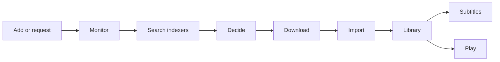

# What Cinomni is

Cinomni is one self-hosted application that takes a movie or a series from "I want to watch this" to
playing it in a browser. It replaces the usual stack of separate tools (a movie manager, a series
manager, an indexer manager, a torrent client, a subtitle fetcher, a media server and a request
system) with one interface, one database and one configuration.

Cinomni does not host, provide or index any content. You connect it to the sources you choose and
you are responsible for using it only with content you have the right to download and store.

## The journey of a title

1. **Add or request.** An administrator adds a title, or a household member requests it and an
   administrator approves it. Metadata and artwork come from TMDB, TheTVDB and TVmaze.
2. **Monitor.** A monitored title is searched for automatically. A series can be monitored whole,
   from now on, by season, or just its pilot.
3. **Search.** Cinomni asks the indexers you configured for releases.
4. **Decide.** Every release is scored against the title's acquisition profile. The chosen one and
   every rejected one keep their reasons, so you can always see *why*.
5. **Download.** A built-in BitTorrent client (libtorrent, in its own container) fetches it,
   optionally only through a VPN tunnel that stops traffic when the tunnel drops.
6. **Import.** The file is hardlinked (or copied) into your library, renamed, and probed for its
   streams. A better release later replaces it and the old file is set aside, never deleted.
7. **Subtitles.** Wanted languages are fetched from subtitle providers and searched again later if
   none exists yet.
8. **Play.** The browser plays the file directly when it can; otherwise Cinomni remuxes or
   transcodes it to HLS and tells you why. Progress is saved per account.

Each step persists its state, so a restart in the middle of any of them resumes rather than starts
over.

## Who does what

| Role | Can |
|---|---|
| **Administrator** | Everything: add titles, configure indexers and profiles, approve requests, manage users, open **Administration**. The first account created is an administrator. |
| **Member** | Browse and watch what they have access to, and request titles when allowed. |

See [Users and access](../administration/users-and-access.md).

## What it is made of

| Part | What it is |
|---|---|
| `cinomni` | The application: backend, web client and FFmpeg, in one container. |
| `postgres` | PostgreSQL 16, which holds every piece of state. |
| `torrent-sidecar` | The isolated BitTorrent engine. It only sees the downloads folder. |
| `flaresolverr` / `indexer-egress` | An isolated browser used only for indexers behind a browser challenge, and the proxy it must go through. |
| `vpn` (optional) | A tunnel container the torrent engine can be sealed inside. |

## What it does not do (yet)

Cinomni is scoped to movies and series on a single Linux amd64 machine. There is no music, books or
photos, no Usenet download client, no native mobile or TV apps, no compatibility with third-party
media-server clients, and no multi-server setup. [ROADMAP.md](../../ROADMAP.md) lists what is next.
